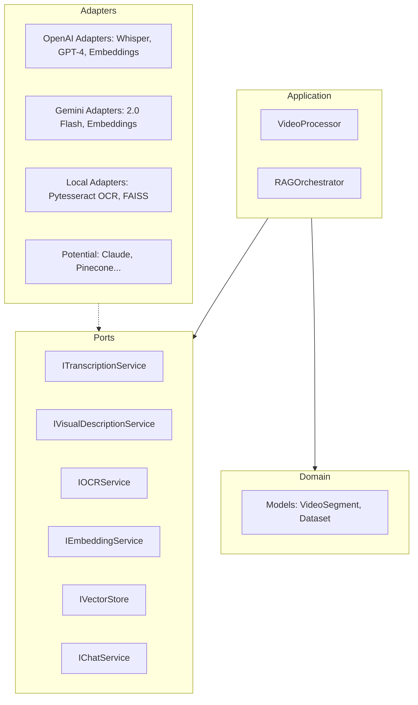

# Multi-modal RAG with Hexagonal Architecture

🚀 A powerful and modular Multi-modal Retrieval-Augmented Generation (RAG) system designed for maximum flexibility. Process videos, extract intelligence, and swap AI services (OpenAI, Gemini, Whisper, etc.) with zero friction.

## 🏗️ Architecture: Hexagonal (Ports & Adapters)

This project follows a **Hexagonal Architecture** (also known as Ports and Adapters). The core business logic is completely decoupled from external services.



### Why this architecture?
- **Provider Agnostic**: Switch from OpenAI to Gemini or local models by simply adding a new adapter.
- **Testable**: Easily mock external services to test core logic.
- **Maintainable**: Clear separation of concerns makes the codebase easier to understand and evolve.

## ✨ Features
- **Video Transcription**: Support for OpenAI Whisper (API), Local Whisper (no token), and Deepgram (accurate timestamps).
- **Scene Detection**: Automatically detect scene changes for precise visual analysis.
- **Multi-modal Indexing**: Combines Audio, OCR, and Visual Descriptions into a unified RAG index.
- **Smart Segmenting**: Index by fixed time intervals (e.g., every 1s) with automatic overrides on scene changes.
- **Timestamped Answers**: Get answers directly tied to specific video segments.

## 🛠️ Installation

1. **Clone the repository**:
   ```bash
   git clone https://github.com/x-eight/rag-multimodal.git
   cd rag-multimodal
   ```

2. **Install dependencies**:
   ```bash
   pip install -e .
   ```
   *Note: Ensure you have `ffmpeg` and `tesseract` installed on your system.*

3. **Set up Environment Variables**:
   ```bash
   export OPENAI_API_KEY="your_api_key"
   ```

## 🚀 Usage

### 1. Index a media file
You can index a video, audio, or image file. The system will automatically detect the file type based on the extension.

**Video (Full):**
```bash
python src/main.py index --file my_video.mp4
```

**Video (Specific range, e.g., from 10s to 30s) with 2s interval:**
```bash
python src/main.py index --file my_video.mp4 --start 10 --end 30 --interval 2
```

**Audio:**
```bash
python src/main.py index --file my_audio.mp3
```

**Audio (Specific range with 5s interval):**
```bash
python src/main.py index --file my_audio.mp3 --start 5 --end 15 --interval 5
```


**Image:**
```bash
python src/main.py index --file my_image.jpg
```

*Indexing returns a unique **Index ID** (e.g., `my_video_a1b2c3d4`).*

### 2. Query an Index
Use the Index ID generated above to ask questions.

```bash
python src/main.py query --id my_video_a1b2c3d4 --question "What happens in the first 5 seconds?"
```

## 🔄 Swapping Services

To swap a service (e.g., using Gemini for visual descriptions):
1. **Create an adapter** in `src/adapters/` that implements the corresponding Port (Interface) from `src/ports/`.
2. **Inject the new adapter** in `src/main.py`.

```python
# In src/main.py
# transcription_service = OpenAITranscriptionAdapter()
transcription_service = MyNewGeminiAdapter() # Swapped in one line!
```

## 📦 Requirements
- `openai`
- `opencv-python`
- `faiss-cpu`
- `numpy`
- `pillow`
- `pytesseract`

## ⚖️ License
This project is licensed under the MIT License.

---

Developed for the AI community.# RAG-multimodal
# RAG-multimodal
